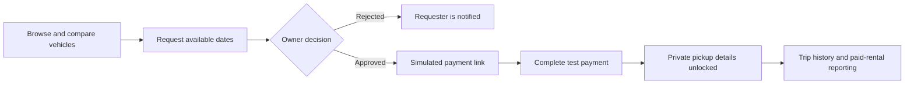

# Nova Rents

> A full-stack, peer-to-peer vehicle rental marketplace for discovering cars, managing listings, coordinating rentals, and moderating the platform.

Nova Rents is a Technion final project built around a two-sided rental experience. A standard account can act as both a renter and a vehicle owner: users can browse available vehicles, publish and manage their own listings, approve rental requests, complete a simulated payment, receive private pickup details, and handle reports tied to paid rentals. Administrators get a separate console for users, vehicles, complaints, and platform analytics.

The project is split into an independent React frontend and an Express/MySQL backend.

## Rental flow



## Frontend features

### Renter and owner experience

- **Authentication and role-aware navigation** — registration, sign-in, session restoration, logout, protected routes, profile editing, and dedicated user/admin application shells.
- **Vehicle marketplace** — paginated listings with cascading filters for brand, model, category, location, and seats, plus sorting by price, year, seats, or newest listing.
- **Vehicle details** — image gallery, availability, pricing, specifications, owner profile, public location map, and a description for every listing.
- **Booking calendar** — unavailable dates are blocked, the first available date is suggested, minimum rental duration is enforced, and the estimated base total is calculated before submission.
- **Map discovery** — browse listings alongside a map, focus the map from a vehicle card, or use browser geolocation.
- **Owner fleet management** — add, edit, filter, soft-deactivate, restore, or mark vehicles as under maintenance; upload up to four images and monitor active vehicle reports.
- **Pickup-location editor** — owners can search for an exact address, use their current position, add pickup instructions, and optionally fine-tune a Google Maps marker.
- **Rental dashboard** — incoming owner requests and renter trips are grouped by vehicle, with approval, rejection, payment, status filtering/counters, and paginated history.
- **Simulated checkout** — account-aware payment pages handle available, unavailable, already-paid, unauthorized, and missing payment links. No real funds or card data are processed.
- **Privacy-aware pickup handoff** — the public marketplace shows only the general location; the exact pickup address, instructions, and directions link are revealed to the renter after payment.
- **Personal dashboard** — monthly earnings, pending requests, upcoming trips, trips taken, notifications, recent activity, and date-filtered earnings/usage charts.
- **Notifications** — unread badge, read/unread filtering, mark-as-read behavior, pagination, and periodic refresh.
- **Complaints and reports** — paid renters can report a vehicle or its owner, attach evidence, follow status updates, and read public admin responses.
- **Report visibility** — users can review complaints they submitted, privacy-safe reports about their account, and reports filed against their vehicles across all statuses.
- **Responsive interface** — CSS Modules, reusable cards and dialogs, status badges, loading/error/empty states, keyboard focus styles, reduced-motion support, and responsive layouts.

### Admin console

- **Operations dashboard** — notifications, recent activity, date-filtered system events, category filtering, and expandable chart series.
- **User administration** — search, role/status filters, pagination, account totals, user-growth analytics, and block/unblock actions.
- **Vehicle oversight** — an inventory overview with status filters and totals, plus brand/model/type catalogue management.
- **Catalogue integration** — administrators can look up official makes and models through the NHTSA vPIC API when adding catalogue data.
- **Complaint moderation** — review report details and evidence, move cases through Open, In Review, Resolved, and Closed states, write a public resolution, and keep separate private admin notes.
- **Business reporting** — date-filtered gross booking value, booking volume, bookings-over-time, complaint trends, and system-activity charts.

## Backend features

- **Modular REST API** — Express routes, controllers, query modules, services, middleware, jobs, and shared utilities are kept in separate layers.
- **MySQL persistence** — pooled `mysql2` connections, parameterized SQL, reusable query modules, and transactions for critical multi-step operations.
- **Session authentication** — credentialed cookie sessions with a 24-hour lifetime, bcrypt password hashing, role checks, ownership checks, and production cookie settings.
- **Vehicle services** — create, retrieve, update, and soft-deactivate listings; manage images and catalogue metadata; and provide filtering, sorting, pagination, owner statistics, booked dates, and status transitions.
- **Rental lifecycle** — conflict detection, self-rental prevention, request approval/rejection/cancellation, dashboard metrics, history, and status reconciliation when dashboard/history data is loaded.
- **Transactional test payments** — cryptographically random payment tokens, requester-only payment authorization, idempotent status transitions, and an immutable pickup-location snapshot committed with the payment.
- **Complaint safeguards** — reporting requires a paid rental relationship, targets are revalidated inside a transaction, and duplicate active reports for the same rental/type are prevented.
- **Privacy-safe report APIs** — reported owners and vehicle owners can see the case without receiving reporter identity or private admin notes.
- **Notifications and activity logs** — personal notifications, unread counts, activity feeds, and system-history events for reporting and auditing.
- **Email workflows** — Gmail/Nodemailer messages for rental requests, rejections, payment links and receipts, owner confirmations, new reports, and report decisions. Email failures are generally non-fatal after the database action succeeds.
- **Scheduled reminders** — a daily job creates deduplicated in-app reminders for approved rentals that start or end the following day.
- **Analytics** — user earnings and usage, admin booking totals and gross value, complaint trends, and system activity with automatic daily/weekly/monthly bucketing.
- **File uploads** — Multer accepts image files only, with up to four files per relevant request and a 5 MB limit per file.
- **Locality and map support** — Israeli localities are fetched from `data.gov.il` and cached in memory; directions use standard Google Maps URLs.
- **Central validation and error handling** — request validation, normalized status codes, stack-trace omission in production responses, and private pickup-field removal from public payloads.

## Technology stack

| Layer          | Technologies                                                  |
| -------------- | ------------------------------------------------------------- |
| Frontend       | React 19, React Router 7, Axios, Vite 8                       |
| UI             | CSS Modules, Lucide React, React DatePicker                   |
| Charts         | Recharts                                                      |
| Backend        | Node.js, Express 5, CommonJS                                  |
| Database       | MySQL/MariaDB via `mysql2`                                    |
| Authentication | `express-session`, bcrypt, credentialed CORS                  |
| Files and jobs | Multer, local uploads, node-cron                              |
| Email          | Nodemailer with Gmail                                         |
| External data  | data.gov.il, NHTSA vPIC, Google Maps, OpenStreetMap Nominatim |

## API overview

The development API runs at `http://localhost:3000`.

| Prefix           | Purpose                                                                                       | Access              |
| ---------------- | --------------------------------------------------------------------------------------------- | ------------------- |
| `/users`         | Registration, login/logout, profiles, public-profile statistics, and admin user management    | Mixed               |
| `/vehicles`      | Marketplace listings, vehicle details, owner inventory, catalogue data, and vehicle mutations | Mixed               |
| `/rentals`       | Availability, requests, decisions, cancellations, history, and dashboard metrics              | Authenticated       |
| `/payments`      | Token-based simulated payment lookup and completion                                           | Authenticated       |
| `/complaints`    | Complaint creation, personal histories, owner-visible reports, and admin moderation           | Authenticated/admin |
| `/notifications` | Notification feed, unread count, and mark-as-read                                             | Authenticated       |
| `/activity`      | Personal activity history                                                                     | Authenticated       |
| `/reports`       | User dashboard reporting and admin analytics                                                  | Authenticated/admin |
| `/gov`           | Cached Israeli locality data                                                                  | Public              |
| `/uploads`       | Uploaded vehicle and complaint images                                                         | Static files        |

Authorization is enforced by the backend. Frontend route visibility is a user-experience layer, not the security boundary.

## Project structure

```text
final-project/
├── frontend/
│   ├── public/                 # SPA redirect configuration
│   └── src/
│       ├── components/         # Reusable cards, dialogs, forms, charts
│       ├── context/            # API calls and shared application state
│       ├── pages/              # Guest, user, admin, and shared screens
│       ├── utils/              # Image and date/period helpers
│       ├── App.jsx             # Role-aware routes
│       └── main.jsx            # Providers and Axios configuration
├── backend/
│   ├── controllers/            # Request handling and business logic
│   ├── database/               # Pool, transactions, and SQL query modules
│   ├── jobs/                   # Scheduled rental reminders
│   ├── middleWare/             # Authentication, uploads, and errors
│   ├── routes/                 # REST endpoint definitions
│   ├── scripts/                # Schema inspection and manual flow checks
│   ├── services/               # Email and government-data integrations
│   ├── uploads/                # Locally stored uploaded images
│   ├── utils/                  # Validation, privacy, date, and map helpers
│   └── server.js               # API entry point
└── README.md
```

## Getting started

### Prerequisites

- Node.js `^20.19.0` or `>=22.12.0`
- npm
- A MySQL/MariaDB-compatible server
- Gmail app credentials if you want to exercise email flows
- A Google Maps API key only if you want Google Places and the interactive pickup map; an OpenStreetMap fallback is available without it

### 1. Clone the repository

```bash
git clone https://github.com/HasanOmar1/Technion-Final-Project.git
cd Technion-Final-Project
```

### 2. Install dependencies

There is no root package, so install the frontend and backend separately.

```bash
cd backend
npm ci

cd ../frontend
npm ci
```

### 3. Prepare the database

The application expects an existing database named `Nova_rents`. The current repository does **not** include a SQL schema, migrations, or seed data, so obtain the project database export and import it before starting the API.

The expected schema contains these tables:

```text
activity_logs, carbrands, carmodels, cartypes, complaints,
notifications, rental_payments, rental_pickup_locations, rentals, system_history, users, vehicles
```

Application analytics are assembled from rentals, complaints, and `system_history`.

In development, the current database configuration is:

| Setting  | Value        |
| -------- | ------------ |
| Host     | `localhost`  |
| Port     | `3306`       |
| User     | `root`       |
| Password | Empty        |
| Database | `Nova_rents` |

`DB_*` environment variables are currently read only when `NODE_ENV=production`. If your local database uses different credentials, update `backend/database/db.js` accordingly.

Registration creates a standard `user` account. For local development, admin access requires an existing seeded admin or manually changing a registered account's `role` to `admin`, followed by signing in again.

### 4. Configure environment variables

Create `backend/.env`:

```dotenv
PORT=3000
NODE_ENV=development
FRONTEND_URL=http://localhost:5173
SESSION_SECRET=replace-with-a-long-random-secret

# Optional locally, required to test email delivery
EMAIL_USER=your-gmail-address@gmail.com
EMAIL_PASS=your-gmail-app-password

# Used by the current code when NODE_ENV=production
DB_HOST=your-database-host
DB_PORT=3306
DB_USER=your-database-user
DB_PASSWORD=your-database-password
DB_NAME=Nova_rents
```

Create `frontend/.env`:

```dotenv
# Used by production builds; development defaults to http://localhost:3000
VITE_API_URL=https://your-api.example.com

# Optional: enables Google Places, interactive maps, and marker adjustment
VITE_GOOGLE_MAPS_API_KEY=
```

Both `.env` files are ignored by Git. Never commit passwords, API keys, or session secrets.

### 5. Start the application

Run the backend from its own directory so relative upload paths resolve correctly:

```bash
cd backend
npm start
```

In a second terminal:

```bash
cd frontend
npm run dev
```

Open `http://localhost:5173`. The frontend expects the local API at `http://localhost:3000`, and the backend development CORS policy expects the frontend at port `5173`.

## Available scripts

### Frontend

| Command           | Description                                  |
| ----------------- | -------------------------------------------- |
| `npm run dev`     | Start the Vite development server            |
| `npm run build`   | Create a production build in `frontend/dist` |
| `npm run preview` | Preview the production build locally         |
| `npm run lint`    | Run ESLint across the frontend               |

### Backend

| Command       | Description                                                        |
| ------------- | ------------------------------------------------------------------ |
| `npm start`   | Start the Express API with Node                                    |
| `npm run dev` | Start with Nodemon; Nodemon must currently be installed separately |

The backend also contains manual database, payment, pickup-snapshot, and email-flow scripts under `backend/scripts`. Some of them create or modify live database records, so inspect each script before running it.

## Privacy and data integrity

- Exact pickup coordinates and instructions are omitted from public vehicle responses.
- A paid rental stores an immutable snapshot of the pickup location so later listing edits do not change an existing renter's instructions.
- Only the requesting renter can complete a payment token.
- Rental owners can act only on requests for vehicles they own.
- Reports require a paid relationship with the target.
- Reported users and vehicle owners receive report details without the reporter's identity or private admin notes.
- Payment and complaint critical sections use transactions and duplicate-transition guards.
- Uploaded files are restricted by MIME type, count, and size.

## External services

| Service                 | Use                                                     | Required?                      |
| ----------------------- | ------------------------------------------------------- | ------------------------------ |
| data.gov.il             | Israeli locality catalogue                              | Yes for locality loading       |
| NHTSA vPIC              | Admin make/model lookup                                 | Only for catalogue lookup      |
| Google Maps             | Embeds, Places autocomplete, marker editing, directions | Optional API key               |
| OpenStreetMap Nominatim | Address-search fallback when no Google key is present   | Fallback                       |
| Gmail SMTP              | Rental, payment, and complaint email notifications      | Optional for local development |

## Important project notes

- **Payments are simulated.** Nova Rents does not connect to Stripe or another real payment processor and does not collect card information.
- **Database bootstrap is external.** A fresh clone still needs the project SQL schema/export because migrations and seeds are not committed.
- **Uploads use local storage.** Production deployments need persistent disk or object storage to prevent uploaded images from disappearing between deployments.
- **Sessions use the default in-memory store.** Replace it with a shared persistent session store before running multiple instances or treating the app as production-ready.
- **Frontend and backend deploy separately.** Set `VITE_API_URL` at frontend build time and `FRONTEND_URL` on the backend. Production cookies are secure and cross-site, so both services must use HTTPS.
- **Scheduled reminders use server time.** The rental reminder job runs daily at `09:00` in the backend process timezone.
- No automated test framework is currently configured; the repository includes targeted manual verification scripts for key backend flows.
